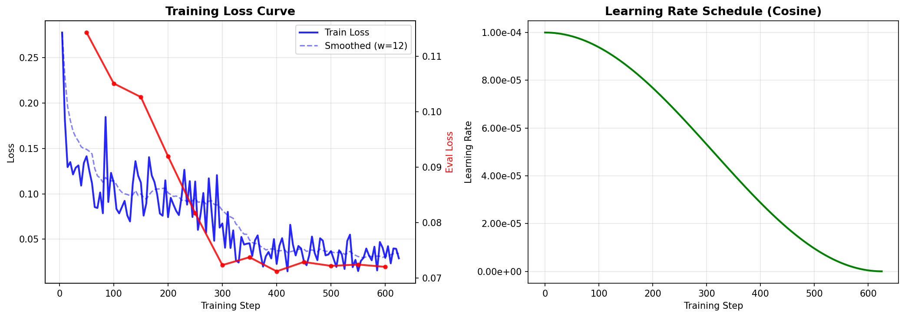
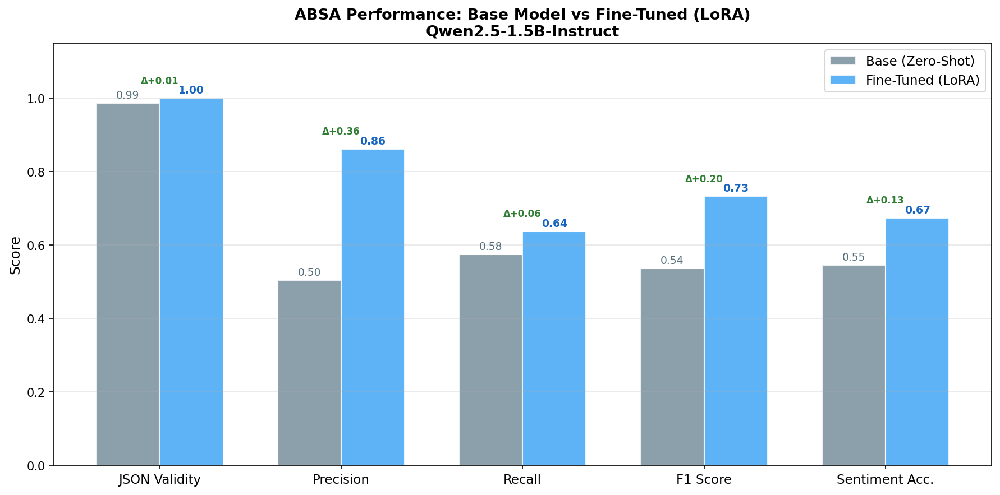
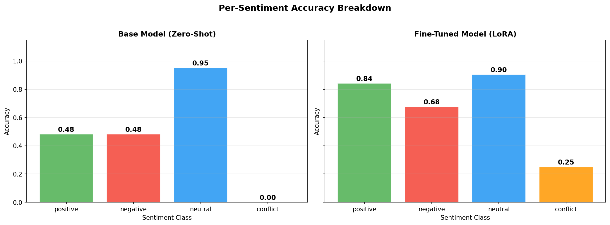

# 🔍 Aspect-Based Sentiment Analysis with LoRA Fine-Tuning

> Fine-tuning **Qwen2.5-1.5B-Instruct** on the SemEval Laptop dataset for structured aspect-level sentiment extraction using **LoRA / PEFT**.

---

## 📋 Table of Contents

- [Overview](#overview)
- [Results](#results)
- [Project Structure](#project-structure)
- [Dataset](#dataset)
- [Model Architecture](#model-architecture)
- [Fine-Tuning with LoRA](#fine-tuning-with-lora)
- [Prompt Engineering](#prompt-engineering)
- [Structured Output & Validation](#structured-output--validation)
- [Training Summary](#training-summary)
- [Evaluation](#evaluation)
- [Error Analysis](#error-analysis)
- [Deployment](#deployment)
- [Reproducibility](#reproducibility)
- [Requirements](#requirements)

---

## Overview

This project implements an **Aspect-Based Sentiment Analysis (ABSA)** system that extracts aspect terms from laptop reviews and assigns a sentiment label to each one. Unlike standard sentiment classification (which returns a single polarity for an entire review), ABSA produces structured, fine-grained output:

```json
{
  "aspects": [
    { "term": "battery life", "sentiment": "positive" },
    { "term": "keyboard",     "sentiment": "negative" }
  ]
}
```

The system is built on top of **Qwen2.5-1.5B-Instruct** fine-tuned with **LoRA adapters** (via HuggingFace PEFT), and enforces structured JSON output through a **Pydantic** validation layer.

---

## Results

## Results

| Metric | Base Model (Zero-Shot) | Fine-Tuned (LoRA) | Δ Improvement |
|--------|----------------------|-------------------|---------------|
| JSON Validity | 100.00% | 100.00% | +0.00% |
| Precision | 53.54% | **88.34%** | +34.80% |
| Recall | 59.91% | **63.44%** | +3.53% |
| F1 Score | 56.55% | **73.85%** | +17.30% |
| Sentiment Accuracy | 54.41% | **76.39%** | +21.98% |

> Evaluated on the SemEval Laptop dataset using a stratified train/validation/test split.

### Training Curves



### Model Comparison



### Per-Sentiment Accuracy



---

## Project Structure

```
NLU_Finetuning/
├── data/
│   └── Laptop_Train_v2.csv          # SemEval laptop reviews dataset
├── model/
│   └── qwen_absa_lora/              # Saved LoRA adapter + tokenizer
│       ├── adapter_model.bin
│       ├── adapter_config.json
│       └── tokenizer files
├── outputs/
│   ├── metrics.json                 # Evaluation results (base vs fine-tuned)
│   └── error_analysis.json          # Categorized prediction errors
├── plots/
│   ├── training_curves.png
│   ├── model_comparison.png
│   ├── sentiment_breakdown.png
│   ├── eda.png
│   └── eda_after_oversampling.png
└── notebook.ipynb                   # End-to-end pipeline notebook
```

---

## Dataset

**Source:** SemEval 2014 Task 4 — Laptop Reviews (`Laptop_Train_v2.csv`)

### Raw Format

| Column | Description |
|--------|-------------|
| `id` | Sentence ID |
| `Sentence` | Review text |
| `Aspect Term` | Extracted aspect (e.g. "battery life") |
| `polarity` | Sentiment label: `positive`, `negative`, `neutral`, `conflict` |
| `from`, `to` | Character offsets |

### Preprocessing Pipeline

1. **Normalize** — lowercase column names, standardize polarity labels
2. **Aggregate** — group flat rows by sentence, collecting all aspect-sentiment pairs into a list
3. **Deduplicate** — remove duplicate `(term, sentiment)` pairs per sentence
4. **Oversample** — The rare `conflict` class was oversampled 3× to reduce severe class imbalance and improve exposure during fine-tuning.
5. **Split** — 80/10/10 train/val/test split (1,190 / 149 / 149 reviews)

### Stratified Train / Validation / Test Split

A custom stratified splitting strategy was implemented to preserve aspect-level sentiment distributions across all splits.

#### Why stratification?

The dataset contains a highly imbalanced `conflict` class with very few examples.  
A purely random split could completely remove rare aspect combinations from the validation or test sets.

#### Solution

Each review was assigned a signature encoding its aspect composition:

```text
p2_n1_u0_c0
```
## Dataset Statistics

| Metric | Value |
|--------|------|
| Raw Aspect Rows | 2,358 |
| Aggregated Reviews | 1,488 |
| Sentiment Classes | 4 |
| Split Ratio | 80 / 10 / 10 |

### Aspect Distribution per Split

| Sentiment | Train | Validation | Test |
|-----------|------|------------|------|
| positive | 790 | 91 | 95 |
| negative | 660 | 95 | 89 |
| neutral | 372 | 45 | 39 |
| conflict | 35 | 4 | 6 |

**Top aspect terms:** `price`, `screen`, `battery life`, `keyboard`, `battery`, `use`, `software`, `programs`

---

## Model Architecture

**Base Model:** [`Qwen/Qwen2.5-1.5B-Instruct`](https://huggingface.co/Qwen/Qwen2.5-1.5B-Instruct)

| Property | Value |
|----------|-------|
| Parameters | 1.5 Billion |
| Architecture | Decoder-only Causal LM |
| Attention | Grouped Query Attention (GQA) |
| Vocab size | 151,643 tokens |
| Max context | 32,768 tokens |
| Format | Instruction-tuned (chat) |

**Why Qwen2.5-1.5B-Instruct?**
- Fits on a single T4 GPU (15.6 GB VRAM) with LoRA overhead
- Native `<|im_start|>` / `<|im_end|>` chat tokens enable precise label masking
- Strong zero-shot JSON generation capability out of the box
- Open-source and freely available for research fine-tuning

---

## Fine-Tuning with LoRA

LoRA (Low-Rank Adaptation) freezes all pre-trained weights and injects small trainable matrices into the attention and MLP layers.

### LoRA Configuration

```python
LORA_CONFIG = {
    "r"              : 16,
    "lora_alpha"     : 32,
    "lora_dropout"   : 0.05,
    "target_modules" : ["q_proj", "k_proj", "v_proj", "o_proj",
                        "gate_proj", "up_proj", "down_proj"],
    "bias"           : "none",
    "task_type"      : TaskType.CAUSAL_LM,
}
```

**Trainable parameters:** ~1.7M out of 1.5B total (**0.11%**)

### Training Hyperparameters

```python
TRAIN_CONFIG = {
    "learning_rate"               : 1e-4,
    "per_device_train_batch_size" : 1,
    "gradient_accumulation_steps" : 4,   # effective batch size = 4
    "num_train_epochs"            : 2,
    "weight_decay"                : 0.01,
    "max_grad_norm"               : 1.0,
    "lr_scheduler_type"           : "cosine",
    "warmup_steps"                : 0,
    "fp16"                        : False,   # float32 for T4 stability
    "optimizer"                   : "adamw_torch",
}
```

**Hardware:** NVIDIA Tesla T4 (15.6 GB VRAM) · Runtime: ~33 minutes · 630 total steps

---

## Prompt Engineering

Each training and inference sample uses the Qwen chat template with a fixed system prompt, one few-shot example, and the target review.

### System Prompt

```
You are an expert Aspect-Based Sentiment Analysis (ABSA) system.
Your ONLY job is to extract aspect terms from laptop reviews and assign a sentiment to each.

RULES:
1. Return ONLY a valid JSON object — no explanation, no markdown, no extra text.
2. The JSON must follow this exact schema:
   {"aspects": [{"term": "<aspect>", "sentiment": "<sentiment>"}]}
3. Valid sentiment values: positive | negative | neutral | conflict
4. "conflict" means the review expresses both positive and negative opinions about the same aspect.
5. Extract ALL mentioned aspects, even if the sentiment is neutral.
6. If no aspects are found, return: {"aspects": []}
7. Use lowercase for both term and sentiment.
```

### Prompt Structure (Training Mode)

```
<|im_start|>system
{SYSTEM_PROMPT}
<|im_end|>
<|im_start|>user
Examples:
Review: {few_shot_review}
Output: {few_shot_output}

Now analyze the following review:
Review: {review_text}
Output:
<|im_end|>
<|im_start|>assistant
{"aspects": [...]}
<|im_end|>
```

### Label Masking

All prompt tokens are masked with `-100` (ignored by `CrossEntropyLoss`). Only the assistant answer tokens contribute to the loss.

```python
def find_response_start(input_ids, template_ids):
    """Find last occurrence of <|im_start|>assistant in token sequence."""
    for i in range(len(input_ids) - len(template_ids), -1, -1):
        if input_ids[i:i+len(template_ids)] == template_ids:
            return i + len(template_ids)
    return -1

labels = [-100] * ans_start + input_ids[ans_start:]
```

> **Critical implementation note:** The answer must be added as a proper `assistant` message via `apply_chat_template`, not appended to the user message content — otherwise the response template is never found and the loss is silently zero.

---

## Structured Output & Validation

Model outputs are parsed and validated through a robust pipeline:

### Pydantic Schema

```python
class AspectSentiment(BaseModel):
    term: str
    sentiment: str

    @field_validator("sentiment")
    def sentiment_must_be_valid(cls, v):
        v = v.strip().lower()
        if v not in ["positive", "negative", "neutral", "conflict"]:
            raise ValueError(f"Invalid sentiment '{v}'")
        return v

    @field_validator("term")
    def term_must_be_non_empty(cls, v):
        if not v.strip():
            raise ValueError("Aspect term cannot be empty.")
        return v.strip()

class ABSAOutput(BaseModel):
    aspects: List[AspectSentiment]
```

### Validation Pipeline

The `validate_output()` function handles all common LLM output quirks:

1. Strip markdown fences (` ```json ... ``` `)
2. Find the first `{` in the output
3. Extract a balanced JSON object (brace-counting)
4. Fix trailing commas (`,}` → `}`, `,]` → `]`)
5. Parse with `json.loads()`
6. Validate with `ABSAOutput(**data)`

**Result:** 100% JSON validity on the test set — zero invalid outputs from the fine-tuned model.

---

### Training Summary

| Metric | Value |
|--------|------|
| Best Eval Loss | ~0.072 |
| Final Train Loss | ~0.029 |
| Best Checkpoint | Step 300 |
| GPU | NVIDIA Tesla T4 |
| LoRA Trainable Params | ~1.7M |
| Total Model Params | 1.5B |

### Pre-Training Sanity Checks

The notebook runs several sanity checks before training begins:

- ✅ Labels contain unmasked tokens (not all `-100`)
- ✅ Forward-pass loss is real and positive (not NaN / zero)
- ✅ LoRA gradients (`lora_A`, `lora_B`) are non-zero after one optimizer step
- ✅ All parameters in `float32` (no mixed precision for T4 stability)

---

## Evaluation

### Metrics

**Aspect Extraction:**
- **Precision** = matched terms / predicted terms
- **Recall** = matched terms / gold terms
- **F1** = harmonic mean of Precision and Recall

A "match" is defined as a normalized (lowercased + stripped) aspect term appearing in both prediction and gold sets.

**Sentiment Quality:**
- **Sentiment Accuracy** = correctly labeled matched terms / total matched terms

**Output Quality:**
- **JSON Validity Rate** = outputs passing Pydantic validation / total outputs

### Running Evaluation

```python
ft_metrics = evaluate_model(
    model      = model,
    tokenizer  = tokenizer,
    test_df    = test_df,
    gen_config = GEN_CONFIG,
)
```

### Generation Config

```python
GEN_CONFIG = GenerationConfig(
    max_new_tokens     = 256,
    do_sample          = False,      # greedy decoding
    repetition_penalty = 1.1,
    pad_token_id       = tokenizer.pad_token_id,
    eos_token_id       = tokenizer.eos_token_id,
)
```

---

## Error Analysis

Errors are categorized into three buckets:

### 1. Missed Aspects
The model predicts some aspects but misses others — typically secondary or implicit aspects.

| Review | Missed | Predicted |
|--------|--------|-----------|
| "...has a horribly cheap feel." | `Looks` (positive) | `feel` (negative) ✓ |
| "...the newer features." | `features` (positive) | `price` (positive) ✓ |
| "...flatline keyboard makes typing easy." | `flatline keyboard` | `keyboard` ✓ |

### 2. Wrong Sentiment
The model finds the correct term but assigns the wrong polarity — usually defaulting to `neutral` for implicit sentiment.

| Review | Term | Gold | Predicted |
|--------|------|------|-----------|
| "firewire cable system can't be used..." | firewire cable system | negative | neutral |
| "apps...quite cheap or free" | apps | positive | neutral |
| "battery life was supposed to be 6 hours..." | battery life | negative | neutral |

### 3. Invalid JSON
**0 invalid outputs** from the fine-tuned model (100% validity rate).

### Key Findings

- **Neutral bias:** The model occasionally defaults to `neutral` for implicit or sarcastic sentiment
- **Multi-aspect gaps:** Reviews with many aspects sometimes have secondary ones missed
- **Partial term matching:** `flatline keyboard` collapsed to just `keyboard`
- **Conflict class (0.00 accuracy):** remains the most challenging category despite oversampling due to:
        - extremely limited data,
        - implicit mixed sentiment,
        - and higher contextual reasoning requirements.
  This highlights a common limitation of small-scale instruction tuning on rare compositional sentiment patterns.

---

## Deployment

### Load the Fine-Tuned Model

```python
from transformers import AutoTokenizer, AutoModelForCausalLM
from peft import PeftModel

base_model = AutoModelForCausalLM.from_pretrained(
    "Qwen/Qwen2.5-1.5B-Instruct",
    torch_dtype=torch.float32,
    trust_remote_code=True,
)
tokenizer = AutoTokenizer.from_pretrained("path/to/qwen_absa_lora")
model = PeftModel.from_pretrained(base_model, "path/to/qwen_absa_lora")
model.eval()
```

### Run Inference

```python
result = predict_absa("The screen is gorgeous but the battery drains fast.")
print(result["aspects"])
# [{"term": "screen", "sentiment": "positive"},
#  {"term": "battery", "sentiment": "negative"}]
```

### FastAPI Web Service

```python
from fastapi import FastAPI
from pydantic import BaseModel

app = FastAPI()

class ReviewRequest(BaseModel):
    text: str

@app.post("/analyze")
async def analyze(req: ReviewRequest):
    result = predict_absa(req.text)
    return {"aspects": result["aspects"]}

# Run with: uvicorn main:app --host 0.0.0.0 --port 8000
```

### Adapter Hot-Swap

```python
# Use base model only (zero-shot)
model.disable_adapter_layers()

# Use fine-tuned model
model.enable_adapter_layers()
```

---

## Reproducibility

All experiments use `SEED = 42` set across all relevant libraries:

```python
SEED = 42
set_seed(SEED)          # transformers
random.seed(SEED)       # Python
np.random.seed(SEED)    # NumPy
torch.manual_seed(SEED) # PyTorch
torch.cuda.manual_seed_all(SEED)
```

---

## Requirements

```
torch>=2.0
transformers>=4.40
peft>=0.10
trl>=0.8
datasets
pydantic>=2.0
pandas
numpy
scikit-learn
matplotlib
seaborn
tqdm
```

Install:

```bash
pip install torch transformers peft trl datasets pydantic pandas numpy scikit-learn matplotlib seaborn tqdm
```

**Hardware:** Tested on NVIDIA Tesla T4 (15.6 GB VRAM) via Google Colab. Runs on CPU for inference (slower).

---

## Citation / Acknowledgements

- Dataset: [SemEval 2014 Task 4](https://www.kaggle.com/datasets/charitarth/semeval-2014-task-4-aspectbasedsentimentanalysis) — Aspect-Based Sentiment Analysis
- Base model: [Qwen2.5-1.5B-Instruct](https://huggingface.co/Qwen/Qwen2.5-1.5B-Instruct) by Alibaba Cloud
- LoRA: [Hu et al., 2021](https://arxiv.org/abs/2106.09685) — *LoRA: Low-Rank Adaptation of Large Language Models*
- PEFT library: [HuggingFace PEFT](https://github.com/huggingface/peft)
